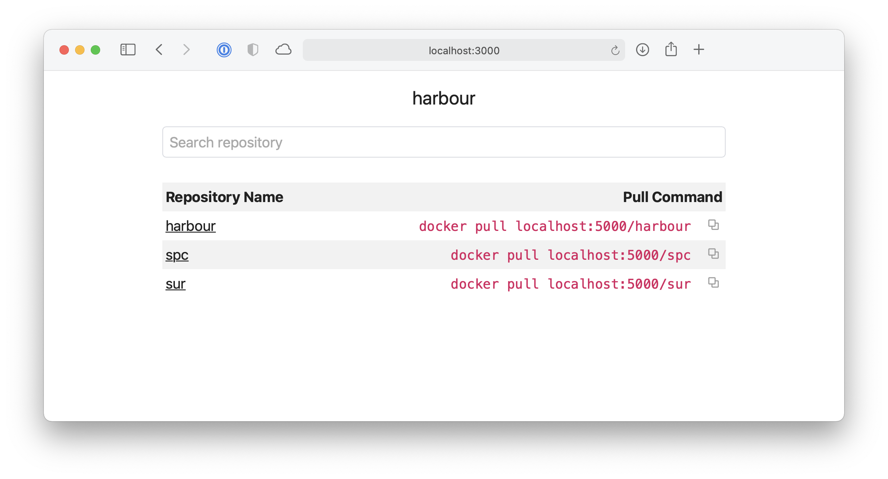

# harbour

A simple docker registry browser to list repositories and tags.



## Configuration

### Environment variables

| Variable                 | Description                                                         | Example               |
| ------------------------ | ------------------------------------------------------------------- | --------------------- |
| BASE_URL                 | Base URL of running app                                             | http://localhost:3000 |
| DOCKER_REGISTRY_BASE_URL | Base URL of Docker Registry                                         | http://localhost:5000 |
| DOCKER_REGISTRY_DOMAIN   | Domain of Docker Registry to pull images, e.g. localhost:5000/hello | localhost:5000        |

## Developer Setup

### Install dependencies

```
$ yarn install
```

### Run tests

```
$ yarn test
```

### Run application

1. Run the Next.js dev command

```
$ yarn dev
```

2. Open [http://localhost:3000](http://localhost)
